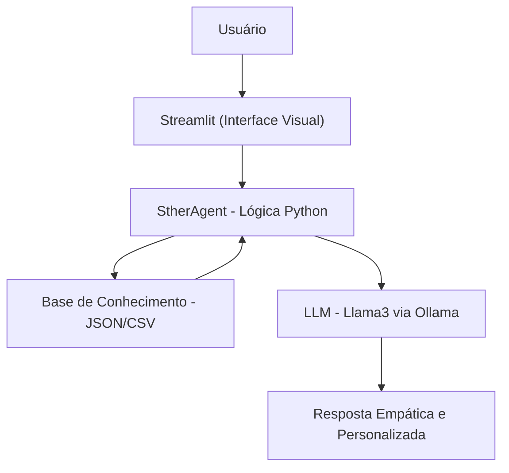

# 🤖 Sther: Agente Financeira Inteligente com IA Generativa

A **Sther** é uma educadora financeira pessoal desenvolvida para transformar a forma como as pessoas lidam com suas finanças. Diferente de chatbots tradicionais, ela utiliza IA Generativa para oferecer um atendimento empático, didático e focado na resolução de dívidas e organização do orçamento.

## 🎯 Caso de Uso

Muitas pessoas enfrentam ansiedade financeira e paralisia por não saberem como organizar suas contas. A Sther resolve esse problema ao:

* **Analisar dados reais**: Processa históricos de transações, perfis de investidor e listas de dívidas.
* **Educar sem julgamento**: Explica estratégias como o método "Bola de Neve" e quitação por maiores juros.
* **Propor ações práticas**: Transforma números complexos em pequenos passos executáveis para o usuário.

## 🛠️ Tecnologias Utilizadas

* **Interface**: [Streamlit](https://streamlit.io/) para uma experiência de chat interativa.
* **Orquestração de IA**: [OpenAI Python SDK](https://github.com/openai/openai-python) conectado ao [Ollama](https://ollama.com/).
* **Modelo de Linguagem**: **Llama3** rodando localmente, garantindo privacidade de dados.
* **Processamento de Dados**: [Pandas](https://pandas.pydata.org/) para análise de fluxos financeiros em CSV.

## 🏗️ Arquitetura do Sistema

O fluxo de dados foi desenhado para garantir que o agente sempre tenha o contexto mais atualizado do cliente:



## 📂 Estrutura da Base de Conhecimento

O agente consome dados estruturados para personalizar o atendimento:

* `perfil_investidor.json`: Contém o momento financeiro e metas do usuário.
* `dividas.json`: Lista credores, taxas de juros e vencimentos.
* `financeiro_2026.csv`: Histórico detalhado de receitas e despesas.
* `produtos_financeiros.json`: Catálogo de investimentos para fins educativos.

## 🛡️ Segurança e Anti-Alucinação

Para atuar no setor financeiro, a Sther segue diretrizes rígidas de segurança:

* **Foco em Dados Reais**: O sistema só utiliza informações contidas nos arquivos de contexto fornecidos.
* **Limites de Atuação**: O agente é proibido de recomendar ativos específicos (ex: ações) ou pedir senhas e dados sensíveis.
* **Transparência**: Caso uma informação não conste na base, o agente admite o desconhecimento em vez de inventar dados.

## 🚀 Como Executar o Projeto

1. **Instale o Ollama** e baixe o modelo Llama3:
```bash
ollama pull llama3

```


2. **Instale as dependências**:
```bash
pip install -r src/requirements.txt

```


3. **Inicie a aplicação**:
```bash
cd src
streamlit run app.py

```


---

*Este projeto foi desenvolvido como parte do desafio de Agentes Financeiros com IA Generativa.*